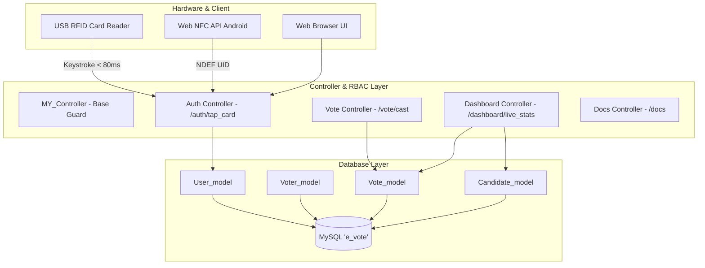

# Simple E-Vote 🗳️

> **Simple E-Vote** is a modern, lightweight electronic voting web application built with **CodeIgniter 3 (MVC)**, **Bootstrap Stisla**, and **MySQL**. It features an instant **Tap ID Card (RFID / NFC) Password Bypass**, strict **Role-Based Access Control (RBAC)**, an **Anti-Double-Voting Booth**, a **Real-Time Live Count Dashboard**, and **Official Election Minutes / Recap Generation (Print & PDF)**.

---

## 🌟 Key Features

1. **Tap ID Card Authentication Bypass (RFID / NFC)**:
   - Password-free instant login by tapping physical RFID/NFC cards (Student IDs, Employee Badges, e-KTP, Mifare 1K tags).
   - **Hardware Keyboard Wedge Support**: Global listener captures high-speed keystrokes (< 80ms) from standard USB RFID scanners without needing to focus on an input field.
   - **Little-Endian Byte Reversal (`hextodes`)**: Automatically converts 4-byte hexadecimal NFC UIDs (e.g., `19:4a:0f:00`) into standard 10-digit decimal RFID strings (`0001002009`).
   - **Web NFC API Support**: Direct native NFC scanning on supported Android Chrome devices.
   - **Interactive Browser Simulation**: One-click demo buttons for testing card taps without physical hardware.
   - **Web Audio API**: Real scanner audio feedback with success chimes (C6 &rarr; E6) and error warning buzzers.

2. **Strict Role-Based Access Control (RBAC)**:
   - **Administrator (`admin`)**: Full CRUD over Candidates and Voters (DPT), access to Database Migration/Seeders, and Official Recap reports.
   - **Voter / Pemilih (`voter`)**: Restrictive *Vote & Read* privileges. The user is locked to their own voter identity and automatically redirected to the voting booth. Once a ballot is cast, the booth locks permanently.

3. **Secure Electronic Voting Booth**:
   - Visual candidate cards with candidate photos, numbers, colors, visions, and missions.
   - Confirmation modal prevents accidental votes.
   - **Atomic Database Transactions (`trans_start` / `trans_complete`)**: Prevents race conditions and guarantees that one voter can only ever cast one ballot.

4. **Real-Time Live Count (Auto-Polling)**:
   - Auto-refreshes every 4 seconds via background AJAX polling (`/dashboard/live_stats`) without requiring browser reload.
   - Dynamic **Chart.js** bar charts, stat cards, percentage progress bars, and incoming vote logs with animated green pulse highlights for new votes.
   - Interactive control buttons: **Pause**, **Resume**, and **Manual Refresh**.

5. **Official Election Minutes & Recap Report (`/dashboard/print_rekap`)**:
   - Standard Indonesian election layout (KPU / PEMIRA format) with official document numbering.
   - Complete statistical breakdown of Registered Voters (DPT), Votes Cast (Valid), and Abstentions.
   - Automatic identification of winner / leading candidate with the *Winner Badge*.
   - Signature blocks for Candidate Witnesses, Committee Secretary, and Election Chairman.
   - Clean `@media print` styling ready for A4 paper and PDF export.

6. **Interactive Documentation (`/docs`)**:
   - Comprehensive technical documentation built with **Mermaid.js** flowcharts, sequence diagrams, and ERD diagrams.

7. **Internationalization (i18n)**:
   - Bilingual support: **English (`en`)** and **Indonesian (`id`)**.
   - Default primary language: **English (`en`)**.
   - Seamless language switching via navbar dropdown or `/lang/switch/{lang}` endpoint.

---

## 🏗️ System Architecture



---

## 🔑 Demo Accounts & Seed Credentials

| Role | Username / Code | Password | RFID Card UID | Name | Notes |
|---|---|---|---|---|---|
| **Admin** | `admin` | `admin123` | `0000000001` | Administrator E-Vote | Full CRUD & Configuration |
| **Voter** | `VTR-2026-009` | `voter123` | `0001002009` | Irfan Hakim | Status: Has Voted |
| **Voter** | `VTR-2026-010` | `voter123` | `0001002010` | Jessica Tan | Status: Has Voted |
| **Voter** | `VTR-2026-011` | `voter123` | `0001002011` | Kevin Sanjaya | Status: Not Voted |
| **Voter** | `VTR-2026-012` | `voter123` | `0001002012` | Laila Fitriani | Status: Not Voted |

*Tip: You can use any of the Card UIDs above on the login page by tapping physical cards or clicking the demo simulation buttons.*

---

## 🚀 Quick Start & Installation

### Requirements:
- PHP 7.4 or higher
- MySQL / MariaDB (e.g. XAMPP)
- Apache Web Server with `mod_rewrite` enabled

### 1. Database Setup:
1. Open **phpMyAdmin** (`http://localhost/phpmyadmin`).
2. Create a database named **`e_vote`**.
3. Import [`database.sql`](database.sql) into the `e_vote` database.

### 2. Environment Configuration (`.env`):
Create or edit `.env` in the root folder:
```ini
ENVIRONMENT=development
BASE_URL=http://localhost/e-vote/

# Database Credentials
DB_HOST=127.0.0.1
DB_PORT=3306
DB_USER=root
DB_PASS=
DB_NAME=e_vote
```

### 3. Open in Browser:
- Login Page: `http://localhost/e-vote/auth/login`
- Documentation & Architecture: `http://localhost/e-vote/docs`
- Dashboard: `http://localhost/e-vote/dashboard`

---

## 🌐 Application URL Routes

| Feature | URL Route | Access Role | Description |
|---|---|---|---|
| **Login** | `/auth/login` | Public | Sign in with Tap Card or Username/Password |
| **Tap Card API** | `/auth/tap_card` | Public | POST endpoint for RFID / NFC card authentication |
| **Language Switcher**| `/lang/switch/{id\|en}` | Public | Switch interface between Indonesian and English |
| **System Docs** | `/docs` | Public | Interactive documentation with Mermaid diagrams |
| **Dashboard** | `/dashboard` | Admin & Voter | Real-time live count, stats, and charts |
| **Live Stats API** | `/dashboard/live_stats` | Admin & Voter | JSON endpoint for live count auto-polling |
| **Print Minutes** | `/dashboard/print_rekap` | Admin & Voter | Official election minutes report (A4 / PDF) |
| **Voting Booth** | `/vote` | Admin & Voter | Electronic ballot casting |
| **Cast Vote Action**| `/vote/cast` | Admin & Voter | Atomic transaction ballot submission |
| **Candidates CRUD** | `/candidate` | Admin & Voter | Candidate management (Admin: CRUD, Voter: Read) |
| **Voters DPT CRUD** | `/voter` | Admin Only | Voter registration & status reset |
| **Re-Seed Database**| `/migrate/seed` | Admin Only | Reset database schema and seed initial data |
| **Reset Votes Only**| `/migrate/reset` | Admin Only | Truncate vote records for a new election run |
| **Logout** | `/auth/logout` | Authenticated | Terminate session and return to login |

---

## 🗄️ Database Schema & DML

The database contains 4 relational tables:
1. `candidates`: Candidate pairs (number, chairman, vice-chairman, vision, mission, photo, theme color).
2. `voters`: Registered voters (code, card UID, name, gender, department, vote status, timestamp).
3. `users`: User authentication accounts (username, bcrypt password, role, synced card UID, voter link).
4. `votes`: Immutable audit ballot records with unique voter constraint.

```sql
-- Sample Voting Transaction (Atomic Integrity)
START TRANSACTION;
INSERT INTO votes (voter_id, candidate_id, ip_address, voted_at) 
VALUES (11, 2, '127.0.0.1', NOW());

UPDATE voters 
SET has_voted = 1, voted_at = NOW(), updated_at = NOW() 
WHERE id = 11;
COMMIT;
```

---

## 🇮🇩 Ringkasan Bahasa Indonesia

Aplikasi **Simple E-Vote** adalah sistem pemilihan elektronik (E-Voting) modern yang dirancang untuk pemilihan ketua umum, OSIS, BEM, maupun organisasi. Dilengkapi dengan:
- **Bypass Login Tap ID Card**: Masuk tanpa kata sandi dengan menempelkan kartu RFID (Mifare 1K/e-KTP) pada card reader USB atau sensor NFC Android.
- **Bilik Suara Aman**: Menjamin satu pemilih hanya dapat memilih satu kali (*Anti Double-Voting*) dengan transaksi database InnoDB.
- **Live Count Real-Time**: Grafik dan persentase terupdate otomatis tiap 4 detik tanpa reload.
- **Berita Acara Resmi**: Format cetak A4 / PDF siap tanda tangan saksi dan panitia.
- **Dukungan Dua Bahasa**: Bahasa Inggris (`en`) sebagai bawaan sistem dan Bahasa Indonesia (`id`).

---

## 📄 License & Credits
Developed as part of the **Simple E-Vote** project. Powered by CodeIgniter 3 and Stisla UI.
